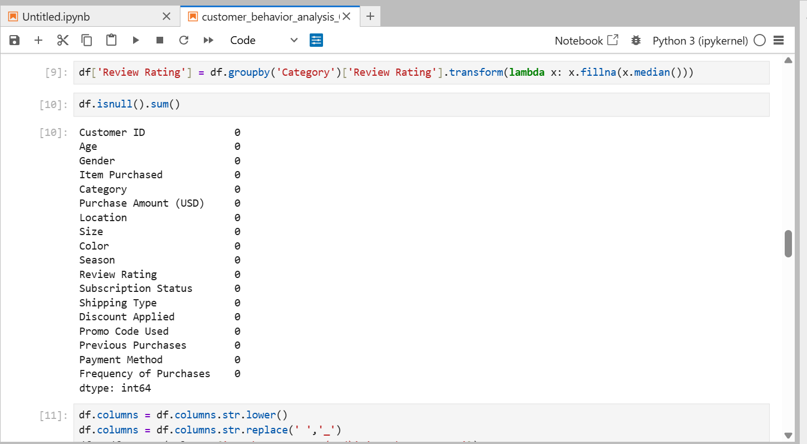
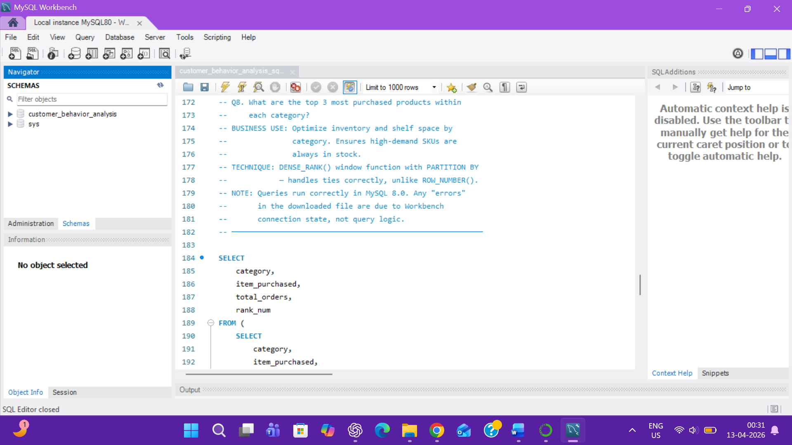
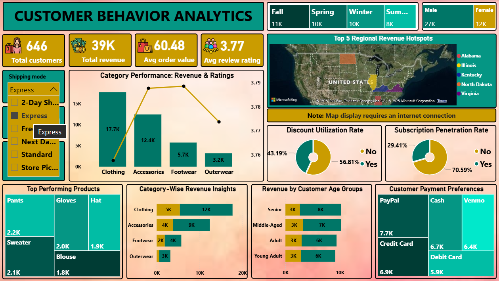

# 🛍️ Customer Shopping Behavior Analytics
### *End-to-End Data Analytics Portfolio Project*

<div align="center">


**Objective:** *Analyze buying patterns and extract meaningful business insights from 3,900 customer purchase records to support strategic decision-making.*

</div>

---


## 📊 Project Snapshot

| Metric | Value |
|--------|-------|
| 📦 Dataset Size | 3,900 Records · 18 Features |
| 💰 Total Revenue Analyzed | $233,081 |
| ❓ Business Questions Answered | 10 SQL Queries |
| 🔧 Tools Used | Python · MySQL · Power BI |
| 🏪 Product Categories | Clothing · Accessories · Footwear · Outerwear |
| ⭐ Avg Review Rating | 3.75 / 5.0 |
| 💵 Avg Purchase Value | $59.76 |

---

## 🧱 Project Architecture

```
Raw CSV Dataset
      │
      ▼
 Python / Pandas  ──────  EDA · Null Imputation · Feature Engineering
      │
      ▼  (SQLAlchemy · df.to_sql())
 MySQL Database  ────────  Relational Storage · customer table
      │
      ▼  (10 Business Queries)
 SQL Analysis  ──────────  Revenue · Segmentation · Products · Loyalty
      │
      ▼  (Power BI Import)
 Power BI Dashboard  ────  Interactive KPIs · Charts · Slicers · Maps

```

---

## 📁 Repository Structure

```
customer-shopping-behavior-analytics/
│
├── 📄 README.md                              ← You are here
├── 📊 customer_shopping_behavior.csv         ← Raw source dataset (3,900 × 18)
├── 🐍 customer_behavior_analysis_01.ipynb     ← Python: EDA, Cleaning, Feature Eng.
├── 🗄️  customer_behavior_analysis_01.sql  ← MySQL: 10 Business Intelligence Queries
├── 📈 customer_behavior_analysis.pbix        ← Power BI: Interactive Dashboard
└── 📝 customer_behavior_portfolio_report.docx ← Full project report
```

---

## 🔍 Phase 1 — Python Analysis (Jupyter Notebook)


**File:** `customer_behavior_analysis_01.ipynb`

### What Was Done:
| Step | Action |
|------|--------|
| 📥 Data Ingestion | Loaded raw CSV with Pandas |
| 🔎 Exploratory Data Analysis | Shape, dtypes, null scan, unique value counts |
| 🧹 Data Cleaning | Non-destructive copy, column standardization (snake_case), null imputation strategy |
| 🏗️ Feature Engineering | Created `age_group` column (18–25, 26–35, 36–50, 50+) for demographic segmentation (Q10) |
| 🚫 Redundancy Removal | Dropped `promo_code_used` (99.9% correlated with `discount_applied`) |
| 📤 DB Loading | Exported cleaned DataFrame to MySQL via `SQLAlchemy` + `df.to_sql()` |

### Key Python Skills Demonstrated:
- `pandas` — data wrangling, `.copy()`, `.fillna()`, `.rename()`, dtype conversion
- `sqlalchemy` — engine creation, authenticated DB connection, table ingestion
- Professional notebook structure with markdown commentary at each stage

---

## 🗄️ Phase 2 — SQL Business Intelligence


**File:** `customer_behavior_analysis_01.sql`  
**Database:** MySQL 8.0

> 10 structured business questions — each query directly answers a real business decision.

| # | Business Question | SQL Concept Used |
|---|-------------------|-----------------|
| Q1 | Revenue by gender | `GROUP BY` + `SUM()` |
| Q2 | Discount users above avg spend | Correlated Subquery + `AVG()` |
| Q3 | Top 5 products by review rating | `GROUP BY` + `ROUND(AVG())` + `ORDER BY` |
| Q4 | Express vs Standard shipping spend | Filtered `GROUP BY` |
| Q5 | Subscriber vs non-subscriber value | Multi-metric `GROUP BY` |
| Q6 | Top 5 most discounted products | Conditional Aggregation (`CASE WHEN`) |
| Q7 | Customer segmentation (New/Returning/Loyal) | `CASE WHEN` + bucketing logic |
| Q8 | Top 3 products per category | **Window Function:** `DENSE_RANK() OVER (PARTITION BY)` |
| Q9 | Repeat buyers → subscription correlation | Filtered `GROUP BY` |
| Q10 | Revenue by age group | Feature-dependent `GROUP BY` |

> 💡 **Q8 uses advanced window functions** (`DENSE_RANK + PARTITION BY`) — a technique rarely seen in entry-level portfolio work.

---

## 📈 Phase 3 — Power BI Dashboard


**File:** `customer_behavior_analysis.pbix`

### Dashboard Highlights:
- 📌 **KPI Cards** — Total Revenue, Avg Purchase, Avg Rating, Total Customers
- 📊 **Revenue by Gender** — Bar chart showing Male vs Female contribution
- 🗓️ **Revenue by Season** — Seasonal equity analysis
- 🗺️ **Geographic Map** — Revenue distribution across all 50 US states
- 🧩 **Customer Segmentation** — New / Returning / Loyal breakdown
- 📦 **Category Performance** — Clothing vs Accessories vs Footwear vs Outerwear
- ⭐ **Top-Rated Products** — Ranked by avg review rating
- 🎛️ **Interactive Slicers** — Filter by Gender, Season, Category, Subscription Status

---

## 📋 Dataset Overview

**Source:** `customer_shopping_behavior.csv`

| Column | Description |
|--------|-------------|
| `Customer ID` | Unique identifier per transaction |
| `Age` | Customer age (18–70) |
| `Gender` | Male / Female |
| `Item Purchased` | One of 25 distinct product SKUs |
| `Category` | Clothing · Footwear · Accessories · Outerwear |
| `Purchase Amount (USD)` | Transaction value ($20–$100) |
| `Location` | US state (all 50 represented) |
| `Size / Color / Season` | Product merchandising attributes |
| `Review Rating` | Customer satisfaction (2.5–5.0) |
| `Subscription Status` | Yes / No |
| `Shipping Type` | Express · Standard · Free · 2-Day · Next Day Air · Store Pickup |
| `Discount Applied` | Yes / No |
| `Promo Code Used` | Yes / No |
| `Previous Purchases` | Count of prior transactions (1–50) |
| `Payment Method` | Credit Card · Venmo · Cash · PayPal · Bank Transfer · Debit Card |
| `Frequency of Purchases` | Weekly · Fortnightly · Monthly · Annually · Bi-Weekly · Quarterly · Every 3 Months |
| `age_group` *(engineered)* | Bucketed age segment for demographic analysis |

---

## 💡 Key Business Insights

| Insight Area | Finding | Recommendation |
|---|---|---|
| 👥 Revenue by Gender | Males generate ~68% of revenue despite equal avg spend | Launch female-targeted acquisition campaign |
| 💳 Subscription ROI | Subscribers spend *less* per transaction ($59.49 vs $59.87) | Add exclusive perks to drive premium spend |
| 🏷️ Discount Strategy | Hats, Sneakers, Coats discounted ~50% of the time | Reduce discount frequency — high-rated items don't need it |
| ⭐ Product Quality | Gloves, Sandals, Boots lead in ratings (3.82–3.86/5) | Feature top-rated products in marketing |
| 🔁 Customer Loyalty | ~80% of customers are Loyal (>10 purchases) | Build tiered loyalty + referral programs |
| 🆕 New Customers | Only ~2.1% of transactions are from new customers | Top-of-funnel investment urgently needed |
| 🚚 Shipping & Spend | Express users spend ~$2 more per transaction | Surface Express shipping for high-AOV items |
| 📅 Seasonal Equity | All 4 seasons nearly equal (~955–999 transactions) | Equal seasonal campaign investment year-round |

---

## 🧠 Skills Demonstrated

```
Data Analytics:     EDA · Feature Engineering · Statistical Aggregation · Customer Segmentation
SQL:                Window Functions · Correlated Subqueries · Conditional Aggregation · CTEs
Python:             Pandas · SQLAlchemy · Data Cleaning · Jupyter Notebooks
Visualization:      Power BI · KPI Design · Interactive Dashboards · Geographic Maps
Business Acumen:    Revenue Analysis · Loyalty Analysis · Discount Effectiveness · Demographic Insights
Communication:      Insight Interpretation · Stakeholder-Ready Reporting
```

---

## ⚙️ How to Run This Project

### 1. Python Notebook
```bash
# Install dependencies
pip install pandas sqlalchemy mysql-connector-python jupyter

# Launch notebook
jupyter notebook customer_behavior_analysis_01.ipynb
```

### 2. MySQL Database
```sql
-- Create and use the database
CREATE DATABASE customer_behavior_analysis;
USE customer_behavior_analysis;

-- Run the SQL file
SOURCE customer_behavior_analysis_01.sql;
```

> **Note:** Queries were written and tested in MySQL Workbench 8.0. Any display errors in downloaded `.sql` files are due to Workbench's connection state, not query logic.

### 3. Power BI Dashboard
- Open `customer_behavior_analysis.pbix` in Power BI Desktop
- Refresh data source to point to your local MySQL instance or CSV

---

## 🏆 What Makes This Project Stand Out

| Differentiator | How It's Achieved |
|---|---|
| ✅ Full Pipeline Coverage | CSV → Python → MySQL → SQL → Power BI — no gaps |
| ✅ Tool Integration | Python engineers features that SQL then exploits — systems thinking |
| ✅ Advanced SQL | Window functions + correlated subqueries (rarely in portfolio work) |
| ✅ Business-First Framing | Every query answers a real business question, not a "show me data" exercise |
| ✅ Professional Code | Non-destructive copying, null imputation strategy, column standardization |
| ✅ Insight Quality | Results interpreted with business context, not just raw numbers |
| ✅ Real-World Scale | 3,900 records · 50 US states · 25 products · 18 features |
| ✅ Documentation | This README itself demonstrates communication — a core analyst skill |

---

## 📬 Contact

> Built as part of a data analytics portfolio to demonstrate end-to-end analytical thinking — from raw data to actionable business strategy.

[](https://linkedin.com)
[](https://github.com)

---

<div align="center">
<sub>⭐ If this project helped you, consider starring the repository!</sub>
</div>


